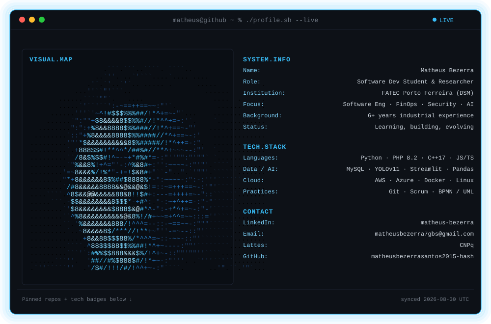

<!-- HEADER -->

<p align="center">
  
</p>

<p align="center">
  <a href="SEU_LINK_PORTFOLIO_AQUI" target="_blank"></a>
  <a href="https://www.linkedin.com/in/matheus-bezerra" target="_blank"></a>
  <a href="mailto:matheusbezerra7gbs@gmail.com"></a>
</p>

---

## About Me

```text
role        → Software Development Student & Academic Researcher
institution → FATEC Porto Ferreira — DSM (2025–2028)
focus       → Software Engineering · FinOps · Cybersecurity · Applied AI
research    → AI Ethics · Metadata · Data Provenance
background  → 6+ years industrial experience
mindset     → Rigor. Curiosity. Continuous Evolution.
status      → Currently learning and developing
```

Multiplatform Software Development student at **FATEC Porto Ferreira**, currently building my knowledge and experience across **Software Engineering, FinOps, Cybersecurity, Data Analysis and Applied AI**.

My academic and personal development is focused on understanding how software, cloud infrastructure, data, security and artificial intelligence can work together to create **reliable, secure and efficient systems**.

> 🚧 **FinOps, Cybersecurity and Applied AI Engineering are currently areas of study and development in my academic and personal journey.**

I also bring an industrial background into my academic path, connecting practical experience with software development, engineering practices and research.

---

## 🔬 Research & Academic Focus

* **Ethical Provenance Metadata for Generative AI** — co-authoring scientific article (TOI event, FATEC Porto Ferreira)
* **Software Engineering** — requirements, BPMN modeling, UML, software quality (ISO/IEC 25010, WCAG 2.1)
* **FinOps & Cloud** — cloud fundamentals, cost awareness, optimization and governance
* **Cybersecurity** — networking, secure development and security fundamentals
* **Applied AI Engineering** — Generative AI, LLMs, RAG, AI integration and automation
* **Data Analysis** — image detection pipelines and data processing
* **Project Management** — Scrum Master & Product Owner in academic projects

---

## 📚 Currently Learning

### ☁️ FinOps & Cloud


* Cloud Computing fundamentals
* AWS
* Azure
* FinOps fundamentals
* Cloud Economics
* Cost optimization
* Cloud governance

### 🔐 Cybersecurity

* Networking fundamentals
* Secure software development
* Application security
* Identity & Access Management
* Cloud Security
* Cybersecurity fundamentals
* Cisco Networking Academy

### 🤖 Applied AI Engineering

* Python for AI
* Machine Learning
* Generative AI
* LLM integration
* Prompt Engineering
* RAG
* Semantic Search
* AI Agents
* AI-powered applications
* Computer Vision

> These areas are currently part of my **learning and development path**, supported by courses, academic research and practical projects.

---

## ⚙️ Technical Stack

**Languages & Backend**


**Data & AI/ML**


**Cloud & Infrastructure**


**Tools & Practices**


---

## 📂 Selected Projects

| Project                                                       | Description                                                                                                                  | Stack                                            |
| ------------------------------------------------------------- | ---------------------------------------------------------------------------------------------------------------------------- | ------------------------------------------------ |
| [ContrataPorto](https://github.com/seu-usuario/contrataporto) | Local job platform for Porto Ferreira/SP — built as **Scrum Master & Product Owner**, end-to-end from architecture to deploy | PHP 8.2 MVC · Vanilla JS · MySQL · JWT · Railway |
| [WorkRPG](https://github.com/seu-usuario/workrpg)             | Gamification system for workplace productivity — data structures course                                                      | C++17 · Qt5                                      |
| SolarScan                                                     | Satellite image detection pipeline for solar panels — FETESP competition                                                     | YOLOv11 · Streamlit · Python                     |

---

## 🎓 Education

**FATEC Porto Ferreira**

🎓 Desenvolvimento de Software Multiplataforma
📅 2025 — 2028
📍 Porto Ferreira, São Paulo, Brazil

Currently pursuing my degree and developing practical experience through **academic research, software projects and continuous technical study**.

---

## 📡 Connect

<p>
  <a href="https://www.linkedin.com/in/matheus-bezerra">
    
  </a>
  <a href="mailto:matheusbezerra7gbs@gmail.com">
    
  </a>
  <a href="http://lattes.cnpq.br/">
    
  </a>
</p>

---

<p align="center">
  
</p>

